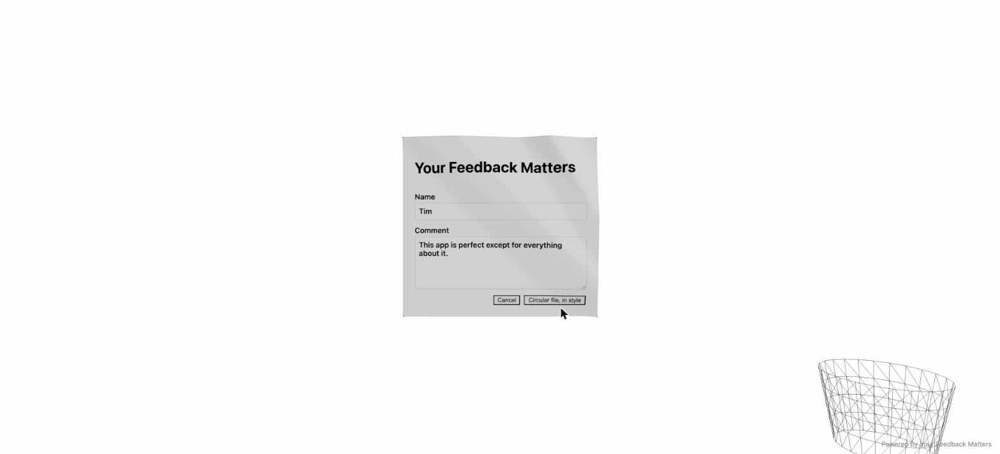

# Your Feedback Matters

A feedback form with exactly one honest feature: **your feedback is never
stored anywhere.** Type a Name and a Comment, hit **"Circular file, in
style,"** and watch the form snapshot itself, crumple into a lumpy paper
ball, and get physically tossed at a wastebasket. About a quarter of throws
rim out and roll away, because that's how throwing paper at a trash can
actually goes. That's the whole product. That's the joke.

Leave a field blank and hit toss anyway, and the form shakes and scolds you
in red: _"Be serious, there's nothing we can do if your feedback is
blank"._ Hit **Cancel** and the form politely closes, replaced by a
**"Got feedback?"** button to reopen it. Either way, nothing you type is
ever sent, saved, logged, or read by anyone. There is no backend.



## How it works

1. **Fill the form.** Name + Comment, client-side only, held in a small
   state machine (`idle → error → capturing → crumpling → tossing →
settling → idle`, see `src/core/feedback-machine.ts`).
2. **Snapshot.** On toss, [`html-to-image`](https://github.com/bubkoo/html-to-image)
   rasterizes the live DOM form into a PNG data URL.
3. **Crumple.** That snapshot is mapped onto a 64×64-segment plane in a
   React Three Fiber scene and deformed into a seeded, lumpy, imperfect
   paper ball via pure procedural math — fold-plane ridges that appear
   progressively, global contraction as the "hand closes," and a
   jittered-sphere attraction term that pulls the sheet into a ball that's
   never quite spherical (`src/core/crumple.ts`). No physics engine is
   involved in the crumple itself — it's a deterministic function of
   `(u, v, t)` given a seed.
4. **Toss.** [`@react-three/cannon`](https://github.com/pmndrs/use-cannon)
   takes over and gives the crumpled ball a real physics body. Its initial
   velocity and spin are solved analytically for a ballistic arc from the
   form's screen position to a wire wastebasket sitting bottom-right of the
   viewport (`src/core/toss.ts`), with a ~25% chance the aim point is
   nudged past the rim so the ball clangs off the basket and rolls away
   instead of swishing in (`MISS_PROBABILITY` in `src/core/constants.ts`).
   Rest is detected by watching the physics body's velocity settle (or a
   timeout, whichever comes first), at which point the ball fades out and
   the form resets for another round.

### Fallbacks

- **`prefers-reduced-motion: reduce`** → the 3D scene and physics toss are
  skipped entirely; the form does an instant fade instead
  (`src/core/animation-mode.ts`).
- **No WebGL2** → same skip, but with a CSS shrink/spin/fly keyframe
  animation standing in for the toss, so the experience still reads as "the
  form got thrown away" without requiring a GPU context.

Mode selection is pure and testable (`pickAnimationMode`), with a thin
`detectAnimationMode()` wrapper that reads `matchMedia` and probes for a
WebGL2 context at runtime.

## Stack

- [Vite](https://vite.dev/) + React 19 + TypeScript (strict)
- [three.js](https://threejs.org/) / [`@react-three/fiber`](https://github.com/pmndrs/react-three-fiber) / [`@react-three/cannon`](https://github.com/pmndrs/use-cannon) for the 3D scene and physics
- [`html-to-image`](https://github.com/bubkoo/html-to-image) for the DOM → texture snapshot
- [Vitest](https://vitest.dev/) + [Testing Library](https://testing-library.com/) for tests
- [pnpm](https://pnpm.io/) as the package manager
- [Husky](https://typicode.github.io/husky/) pre-commit hook: `lint-staged`
  (Prettier on staged files) → repo-wide `prettier --check` → `tsc -b` →
  `vitest run`

## Getting started

```bash
pnpm install
pnpm dev       # local dev server
pnpm test      # run the test suite (vitest run)
pnpm build     # tsc -b && vite build → dist/
```

39 tests currently cover every pure module in `src/core/` plus the app's
phase-transition wiring end to end (blank scold, cancel/reopen, capture →
crumple → toss → settle → reset, and both fallback modes).

## Architecture

```
src/
  core/                    pure, dependency-light, unit-tested logic
    rng.ts                 seeded PRNG (mulberry32) — every random choice
                            downstream is derived from one seed, so a toss
                            is fully reproducible given that seed
    feedback-machine.ts    the form's phase state machine + reducer
    crumple.ts             procedural fold/contract/lump math → CrumpleField
    toss.ts                ballistic velocity/spin solver, rim-miss logic
    screen-to-world.ts     maps the form's DOM rect into R3F world space
    animation-mode.ts      reduced-motion / no-WebGL / full3d selection
    constants.ts           physics & timing tuning knobs
    copy.ts                all user-facing strings, in one place

  scene/                   thin React Three Fiber components — consume
                            core/ outputs, render them, stay dumb
    crumple-scene.tsx      top-level scene, phase-driven composition
    crumpling-paper.tsx    snapshot-textured plane, animated via CrumpleField
    tossed-ball.tsx        physics body driven by planToss(), rest detection
    wastebasket.tsx        wire-frame basket + compound collider
    ground.tsx             ground plane collider

  feedback-form.tsx        the DOM form (Name, Comment, Cancel, Toss)
  app.tsx                  app shell: wires the state machine, the DOM
                            form, the 3D scene (or a fallback), and the
                            snapshot capture, per the resolved animation mode
  main.tsx                 React root
```

The `core/` modules have no React or Three.js dependency and are TDD'd in
isolation; `scene/` and the top-level components are deliberately thin —
they read state and forward it into `core/` functions rather than
reimplementing any of the math.

## Docs

- Design spec: [`specs/2026-07-01-crumple-feedback-form-design.md`](./specs/2026-07-01-crumple-feedback-form-design.md)
- Implementation plan: [`plans/2026-07-01-crumple-feedback-form-plan.md`](./plans/2026-07-01-crumple-feedback-form-plan.md)
- Ideas not yet built: [`WISHLIST.md`](./WISHLIST.md)

## Deploying

Pushing to `main` runs [`.github/workflows/deploy.yml`](./.github/workflows/deploy.yml):
typecheck → test → build → publish `dist/` to GitHub Pages.
